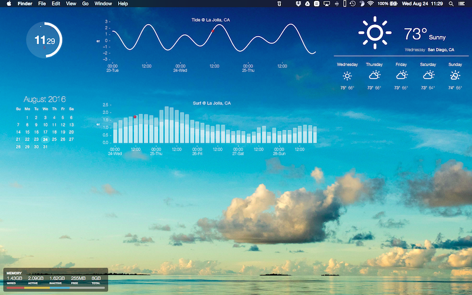

# Surf widget for übersicht app

Widget to display surf prediction using the os x app [übersicht](http://tracesof.net/uebersicht/).

Based on matplotlib and a few other python libraries. You need to get your own API key at magicseaweed.com
and store it in a simple ascii file called mswapi.txt

